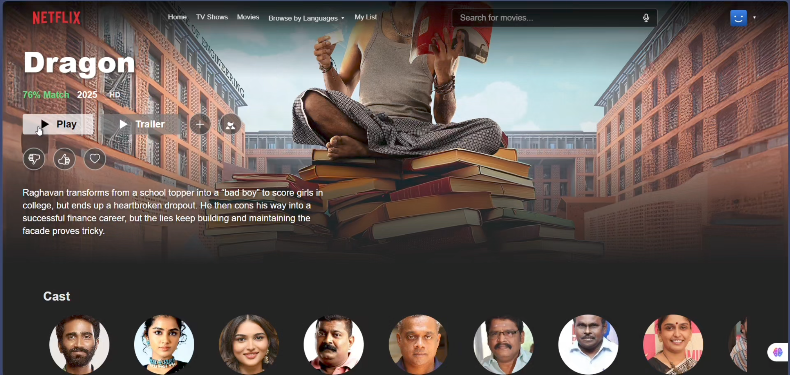
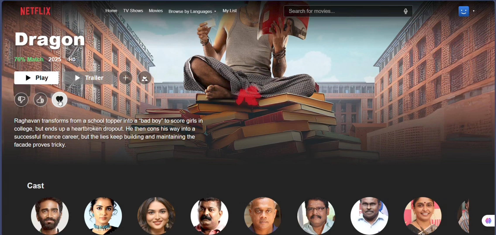
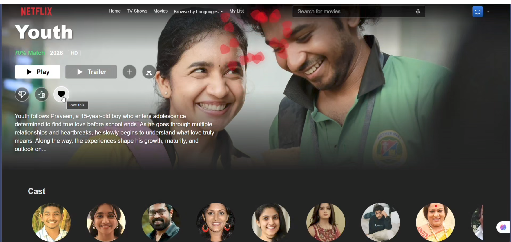
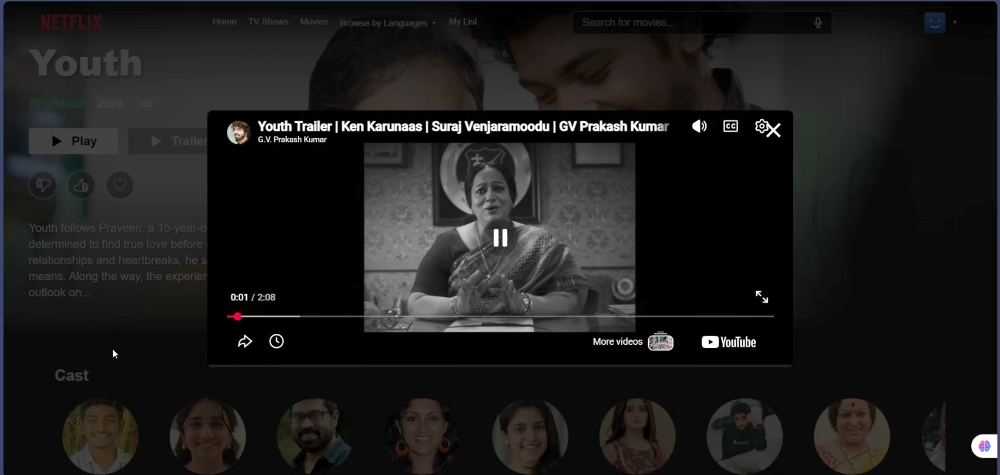
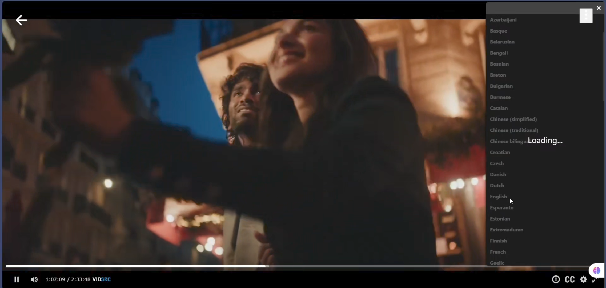
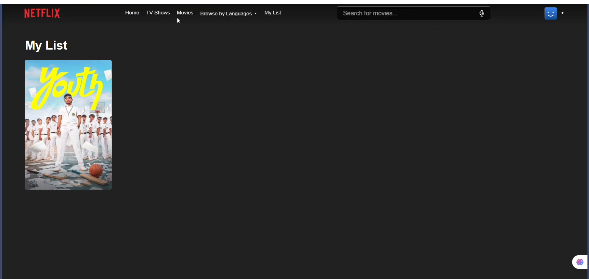

#  Netflix Clone - Production Ready

A high-performance Netflix clone built with the **MERN stack**, **Firebase Authentication**, **Cloud Firestore**, and **TMDB API**.

## 📸 Visual Walkthrough

### 🎥 Project Demo Video
[Click here to watch the full demo video](./netflix_video.mp4)

### 1. Premium Hero Banner & Navigation


### 2. Mood Based Suggestions


### 3. Interactive Rating - Heart Hover & Animation



### 4. Intelligent Trailer System (Auto-Play Popup)


### 5. Advanced Player - Audio & Subtitle Controls



### 6. Cloud-Synced My List


### 7. Voice-Enabled Search


### 8. Parental PIN & Profile Security


## 🌟 Premium Features Implemented
- **🤖 Intelligent Trailer System**: Automatically fetches HD YouTube trailers using a highly robust multi-server fallback architecture (6+ Invidious API instances & `movie-trailer` library). It intelligently prioritizes fetching trailers in the movie's native/original language for an authentic experience.
- **🎉 Real-Time Watch Party**: Seamlessly integrated co-viewing experience powered by Firebase Firestore, allowing users to watch synchronized streams with friends.
- **🎨 Cinematic UI/UX**: Pixel-perfect Netflix-accurate design. Features include glassmorphic transparent navigation bars, full-screen background video banners, customized 16:9 player wrappings, and dynamic "Top 10" ranking badges.
- **💖 Interactive Rating System**: Netflix-style "Like", "Dislike", and "Love" rating buttons, featuring a custom `framer-motion` powered animated heart-burst effect upon interaction.
- **🎭 In-Depth Title Details**: Rich detail pages featuring dynamic cast lists (with actor profile images), TV show season/episode selectors, and intelligent "More Like This" recommendations.
- **🎙️ Voice-Enabled Search**: Hands-free voice search functionality directly integrated into the sleek animated search bar.
- **👥 Multi-Profile Management**: "Who's Watching" screen, customizable avatars, and a dedicated 'Kids' profile toggle for filtered viewing.
- **🔐 Parental PIN Security**: Integrated profile-level PIN protection to secure individual user accounts and restrict access.
- **☁️ Cloud-Synced 'My List'**: Cross-device syncing of your watchlist directly to Firebase Firestore, managed efficiently via Redux Toolkit state management.
- **🎬 Advanced Streaming Player**: Custom player interface with multiple streaming server fallbacks to guarantee continuous playback, complete with subtitle and audio options.
- **🔒 Secure Authentication**: Powered by Firebase Auth (Email/Password registration and an instant Guest Login Bypass).

## Tech Stack
- **Frontend**: React.js, Redux Toolkit (State Management), React Router v7.
- **Backend**: Firebase (Authentication & Firestore).
- **API**: TMDB (The Movie Database).
- **Styling**: Vanilla CSS with modern flexbox/grid.

## Getting Started

1. **Clone the repo**
   ```bash
   git clone https://github.com/Dhevas325/netflix-clone.git
   ```

2. **Install dependencies**
   ```bash
   npm install
   ```

3. **Set up Environment Variables**
   Create a `.env` file in the root and add:
   ```env
   VITE_TMDB_API_KEY=your_tmdb_api_key
   ```

4. **Run the App**
   ```bash
   npm run dev
   ```

## Security Notice
If you accidentally pushed your `.env` file to GitHub, please follow these steps to remove it from history:
1. Add `.env` to your `.gitignore`.
2. Run `git rm --cached .env`.
3. Commit and push: `git commit -m "Remove sensitive .env file" && git push`.
4. **IMPORTANT**: Reset your TMDB API key in the TMDB dashboard.

## License
MIT License. Created by [Dhevas325](https://github.com/Dhevas325).
