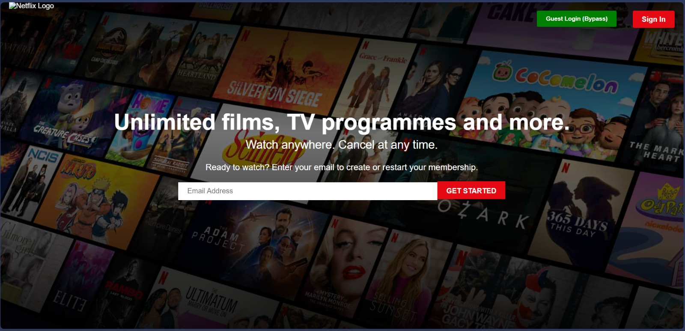

# üçø Netflix Clone - Production Ready

A high-performance Netflix clone built with the **MERN stack**, **Firebase Authentication**, **Cloud Firestore**, and **TMDB API**.

## üôî Visual Walkthrough

### 1. Who's Watching?


### 2. Premium Hero Banner


### 3. Netflix Original Content


### 4. Regional Selections (Tamil & Hindi)


### 5. Smart Search functionality


### 6. Dynamic Title Details & Episodes


### 7. Ultra-Fast Global Streaming Player


## Hollywood Features
- **üîì Secure Authentication**: Powered by Firebase Auth (Email/Password & Guest Bypass).
- **üîç Dynamic Search**: Real-time movie and TV show search using TMDB API.
- **üì∫ Advanced Player**: Multiple server options (Server 1, 2, 3) for smooth streaming.
- **üìå My List (Watchlist)**: Add your favorite titles to your personal list (Synced with Redux & Firestore).
- **üç± Premium UI**: Smooth transitions, glassmorphism, and Netflix-accurate design.
- **üì∫ Dynamic Banner**: Automatically fetches trending Netflix Originals for the hero section.

## Tech Stack
- **Frontend**: React.js, Redux Toolkit (State Management), React Router v7.
- **Backend**: Firebase (Authentication & Firestore).
- **API**: TMDB (The Movie Database).
- **Styling**: Vanilla CSS with modern flexbox/grid.

## Getting Started

1. **Clone the repo**
   ```bash
   git clone https://github.com/Dhevas325/netflix-clone.git
   ```

2. **Install dependencies**
   ```bash
   npm install
   ```

3. **Set up Environment Variables**
   Create a `.env` file in the root and add:
   ```env
   VITE_TMDB_API_KEY=your_tmdb_api_key
   ```

4. **Run the App**
   ```bash
   npm run dev
   ```

## üö® Security Notice
If you accidentally pushed your `.env` file to GitHub, please follow these steps to remove it from history:
1. Add `.env` to your `.gitignore`.
2. Run `git rm --cached .env`.
3. Commit and push: `git commit -m "Remove sensitive .env file" && git push`.
4. **IMPORTANT**: Reset your TMDB API key in the TMDB dashboard.

## License
MIT License. Created by [Dhevas325](https://github.com/Dhevas325).
