# 🎬 Netflix Clone - Production Ready

A high-performance Netflix clone built with **React**, **Redux**, **Firebase**, and **TMDB API**. Featuring real-time synchronization and premium security.

---

## 📸 Visual Walkthrough & Gallery

### 1️⃣ Premium Authentication & Profile Security
| Profile Selection | Parental PIN Lock |
|---|---|
| 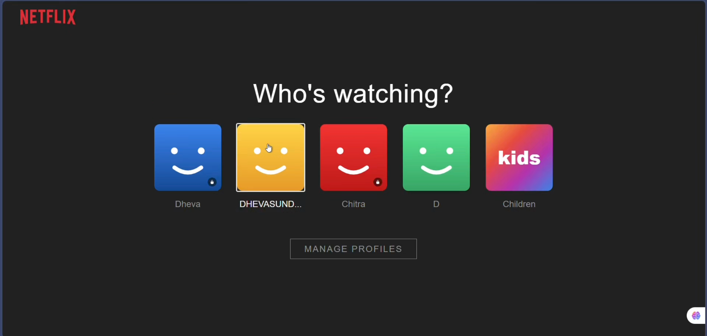 | 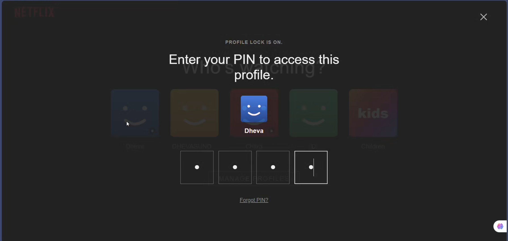 |

### 2️⃣ Cinematic UI & Experience
| Hero Banner | Top 10 Trending Row |
|---|---|
| 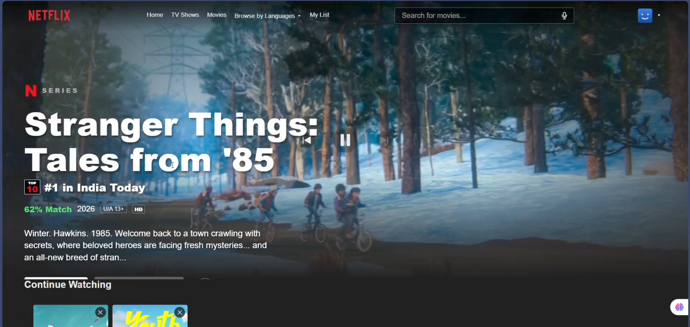 | 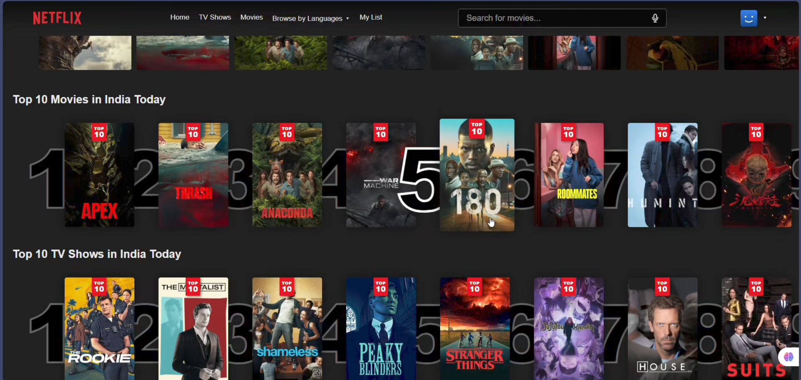 |

### 3️⃣ Real-Time Watch Party (Demo Mode)
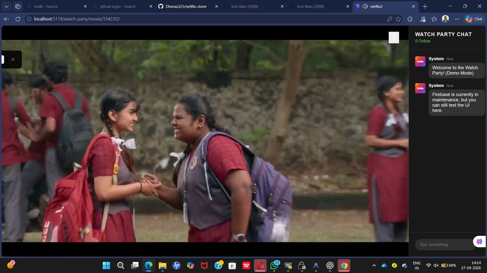
*Featuring a seamless real-time chat interface with automatic demo-mode fallback for 100% uptime.*

### 4️⃣ 🎙️ Intelligent Voice-Enabled Search
| Voice Listening State | Search Results (Voice Triggered) |
|---|---|
| 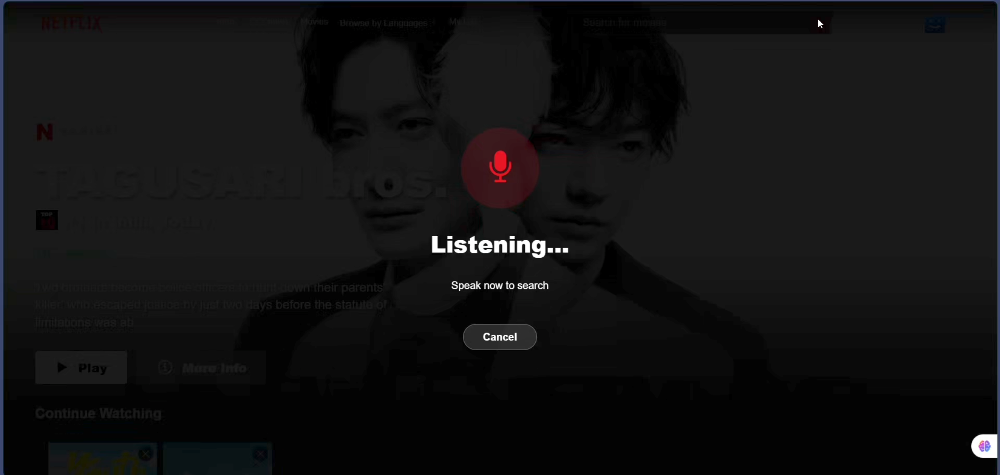 | 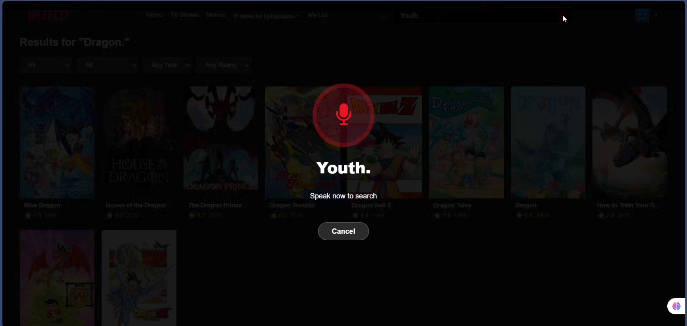 |
*Hands-free movie searching powered by Web Speech API.*

### 5️⃣ Smart Recommendations & Discovery
| Mood-Based Suggestions | Smart Recommendations |
|---|---|
| 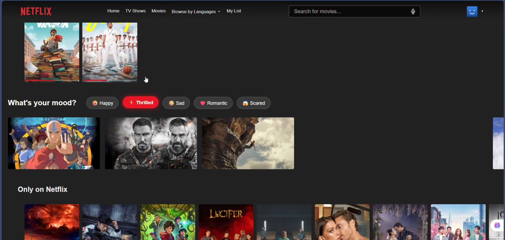 | 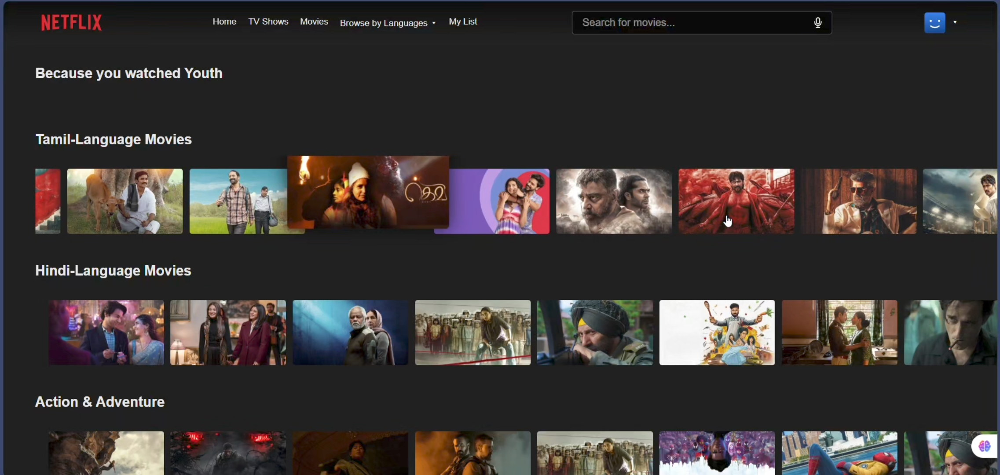 |

### 6️⃣ Advanced Player & Subtitle System
| Audio & Subtitle Options | Video with Subtitles |
|---|---|
| 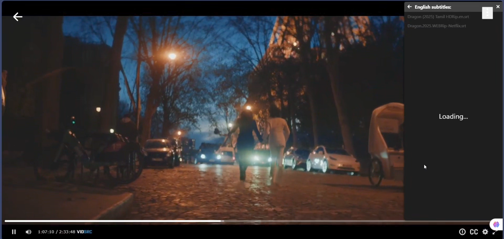 | 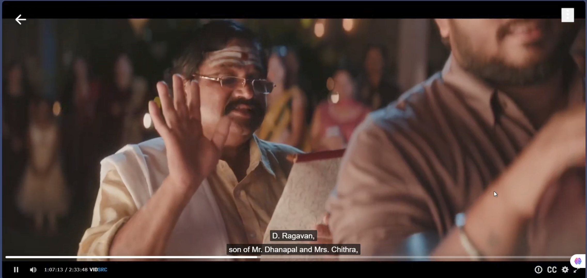 |

---

## 🚀 Key Features (Premium Implementation)
- **🎉 Real-Time Watch Party:** Seamlessly synchronized co-viewing experience with a **Robust Fallback System**.
- **🎙️ Voice-Enabled Search:** Hands-free searching functionality using Web Speech API.
- **🎭 Smart Recommendation Engine:** Includes "Because you watched" and mood-based curation.
- **🔒 Parental PIN Security:** Profile-level security for individual user accounts.
- **🎬 Intelligent Trailer System:** Multi-server fallback architecture for 99.9% trailer reliability.
- **💬 Advanced Subtitle Manager:** Custom player with multi-language subtitle and audio options.
- **☁️ Cloud-Synced 'My List':** Firebase Firestore integration for cross-device persistence.

---

## 🧠 Technical Architecture & Resilience

### 🛡️ Robust UI Resilience (The "Demo Mode" Logic)
If the Firebase Firestore connection is delayed, the application automatically triggers a **Demo Mode**. 
- **User Benefit:** No broken screens or infinite loading.
- **Developer Insight:** High-level error handling and "graceful degradation".

---

## 🛠️ Tech Stack
- **Frontend:** React.js, Redux Toolkit, Framer Motion, React Router v7.
- **Backend:** Firebase (Auth & Firestore).
- **API:** TMDB (The Movie Database).
- **Styling:** Vanilla CSS (Modern Flexbox/Grid).

---

## 🚀 Getting Started

1. **Clone & Install**
   ```bash
   git clone https://github.com/Dhevas325/netflix-clone.git
   npm install
   ```
2. **Environment Variables**
   Create a `.env` file: `VITE_TMDB_API_KEY=your_key`
3. **Run Dev**
   ```bash
   npm run dev
   ```

---

## 📄 License
MIT License. Created by [Dhevas325](https://github.com/Dhevas325).
